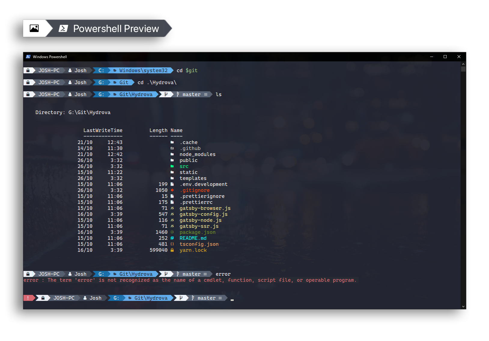
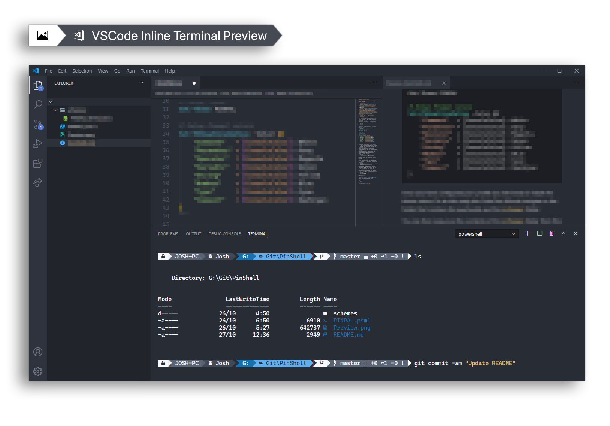

# Frupis

**Windows Powershell Theme**

Color and Powerline style prompt theme for Windows Powershell.

## Prerequisites

1. Follow the installation for [oh-my-posh v2](https://github.com/JanDeDobbeleer/oh-my-posh)
2. Download [ColorTool](https://github.com/microsoft/terminal/tree/main/src/tools/ColorTool) from Microsoft
3. Ensure you have installed a Powerline font patched with Nerd Fonts included. I personally use [CascadiaCode](https://github.com/ryanoasis/nerd-fonts/blob/master/patched-fonts/CascadiaCode/complete/Caskaydia%20Cove%20Regular%20Nerd%20Font%20Complete%20Mono%20Windows%20Compatible.ttf) but there is a large selection in [this repo](https://github.com/ryanoasis/nerd-fonts/tree/master/patched-fonts).
4. Open a Powershell window and right click the title bar and configure both the defaults and current properties such that you are using one of the above patched fonts.
5. Clone this repo to a temporary folder.

## Installation

After you have completed the prerequisites, the first step is to configure your `$profile`. This file is equivilent to the `.bashrc` found in a UNIX system.
The directory of which can be found by entering the following into a powershell window:

```powershell
PS > $profile
```

You will need to add the following lines to the end of the file:

```powershell
# Import Modules
Import-Module posh-git
Import-Module oh-my-posh

# Setup Theme
Set-Theme PINPAL

# Setup Prompt colors
Set-PSReadlineOption -Color @{
    "Command"   = [ConsoleColor]::White
    "Parameter" = [ConsoleColor]::Gray
    "Operator"  = [ConsoleColor]::Magenta
    "Variable"  = [ConsoleColor]::Green
    "String"    = [ConsoleColor]::Yellow
    "Number"    = [ConsoleColor]::Blue
    "Type"      = [ConsoleColor]::Cyan
    "Comment"   = [ConsoleColor]::DarkCyan
}
```

Once you have configured your profile you will need to install the theme colors.
To do this unzip the ColorTool fill and navigate to the folder that contains the exectuable and the `schemes` folder.

You can then copy over the contents of the `schemes` folder from this repo into the one from ColorTool.

Next open up powershell and navigate to the ColorTool directory. Execute the following command to install the theme.

```powershell
PS > ./ColorTool.exe -b PINPAL.itermcolors
```

You should now see that your terminal is nicely coloured.

The last step is to install the prompt theme.
You can find the directory that the theme needs to be installed to by entering the following into powershell:

```powershell
PS > $ThemeSettings.MyThemesLocation
```

Navigate to the `MyThemesLocation` folder and copy over the `PINPAL.psm1` file from this repo.
If this folder does not exist you may have to create it.

The final step is to enable the theme which can be done by entering the following into powershell:

```powershell
PS > Set-Theme PINPAL
```

### **Optional**

The following steps are for installing correct colors to VSCode Integrated Terminal. This can be used to overwrite your VS theme colours.

Open the Command Pallette (`Ctrl+Shift+P`) and type in `Open Settings (JSON)`
Once the `settings.json` file is open you add the following lines within the main settings object:

```yaml
{
  # terminal font
  "terminal.integrated.fontFamily": "'CaskaydiaCove NF', 'Consolas', monospace",
  #override terminal colors from theme
  "workbench.colorCustomizations":
    {
      "terminal.background": "#282C34",
      "terminal.ansiBlack": "#282C34",
      "terminal.foreground": "#F6F9FF",
      "terminal.ansiBlue": "#1672AF",
      "terminal.ansiBrightBlue": "#61AFEF",
      "terminal.ansiBrightBlack": "#424855",
      "terminal.ansiRed": "#E06C75",
      "terminal.ansiWhite": "#5A6374",
    },
}
```

You can change the fontFamily to fit your desired font but you must again make sure that you are using a font that has both powerline support and Nerd Fonts.

## Preview



</br>


